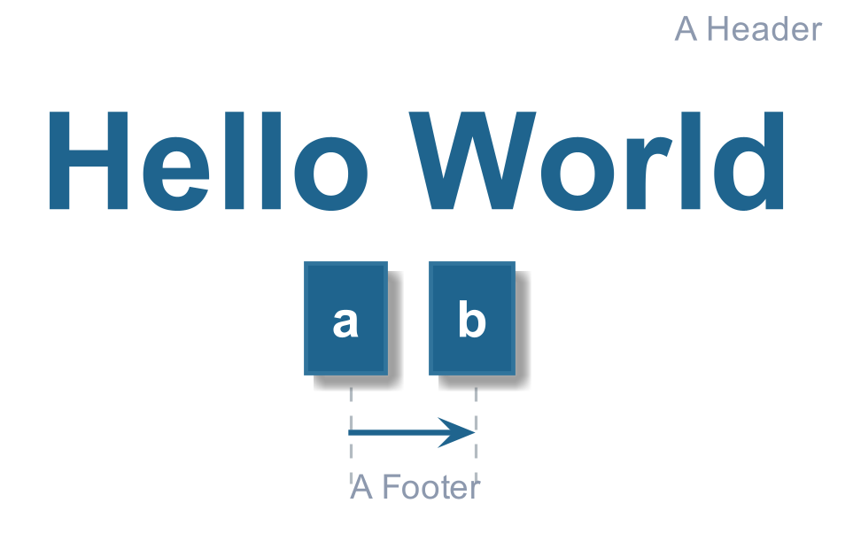
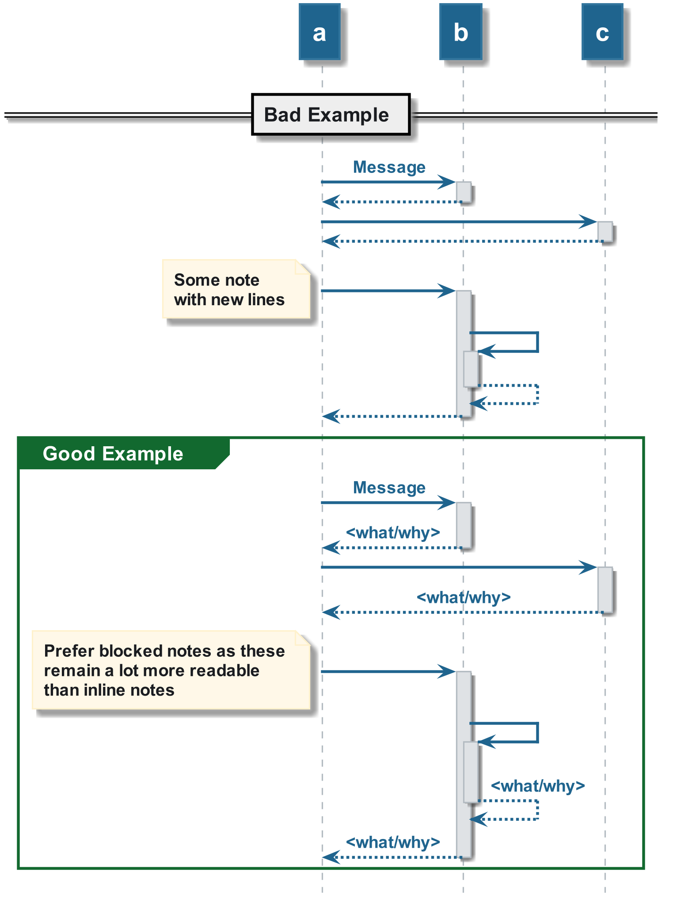

# Hello World

This provides people with an introduction to PlantUML and some tips to keep the
PlantUML script clean and readable.

## Hello World Example

The [Code Example](./01_hello_world.plantuml) for the diagram below demonstrates how
you can add headers, footers titles and basic sequence to a diagram.

## Clean Code Example

The [Code Example](./02_clean_and_readable.plantuml) for the diagram below demonstrates how
we can keep the scripting clean and readable as it scales up.

The example illustrates that they may look the same on the surface, however when
you start looking through the code it can quickly become unreadable and not clear.

________

| [BACK](../README.md) | [HOME](../../README.md) |
|:--------------------:|:-----------------------:|
