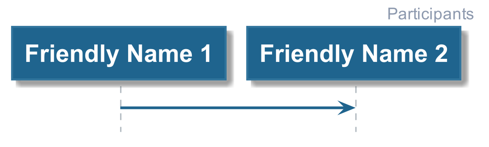

# Hello World

This provides people with an introduction to PlantUML and some tips to keep the
PlantUML script clean and readable.

## Defining Participants

Participants are shown at the top of the diagram, when defined they create a dashed
lifeline.

The [Code Example](./01_defining_participants.plantuml) demonstrates how to define and use a participant.

It also covers how to give them friendly names (shown in the diagram) separate the to the code reference.

## Types of Participants

The [Code Example](./02_participant_types.plantuml) demonstrates the different available types of
participant and how to define them, the different types are also shown below in the diagram.

## Participant Stereotypes

Participants may belong to a group or type, and stereotypes can be used to show that visually. 
The [Code Example](./03_participant_stereotypes.plantuml) demonstrates how to define stereotypes
for participants as shown below in the diagram.

## Boxing Participants

You can also group participants as shown below. The [Code Example](./04_boxing_participants.plantuml)
demonstrates how you can define boxes around multiple participants.

________

| [BACK](../README.md) | [HOME](../../README.md) |
|:--------------------:|:-----------------------:|
