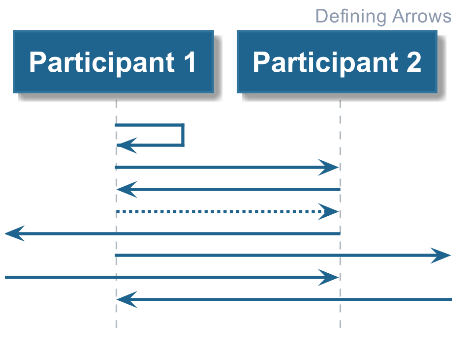
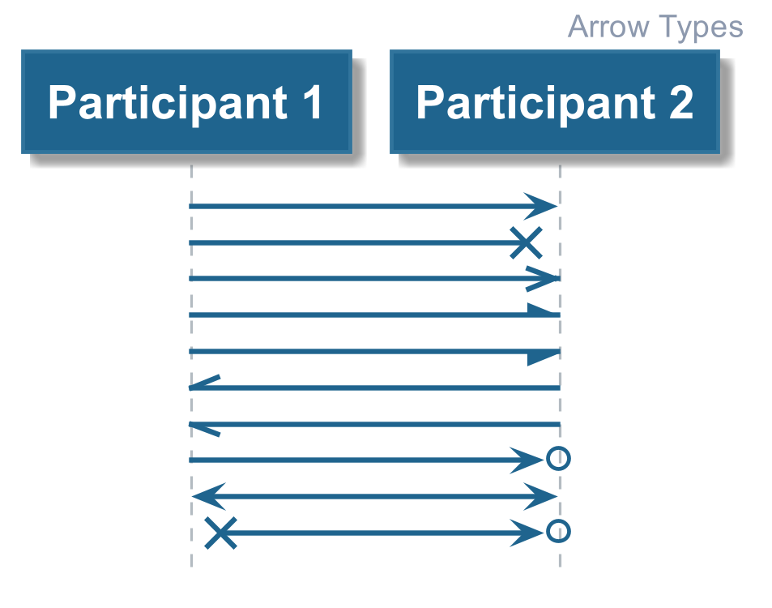
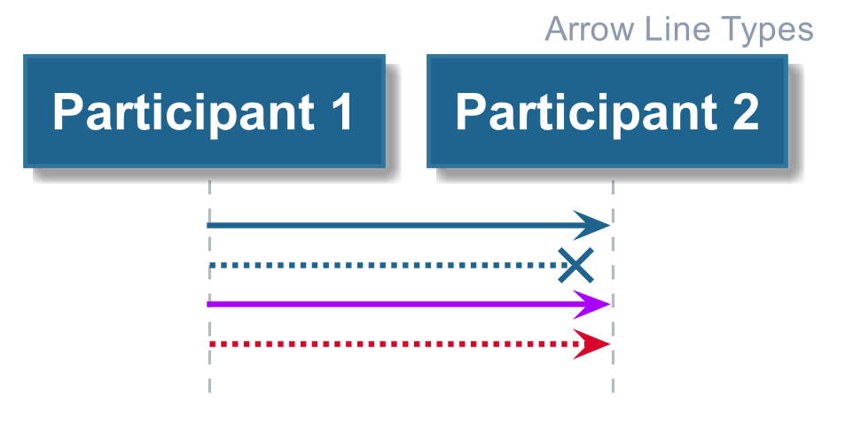
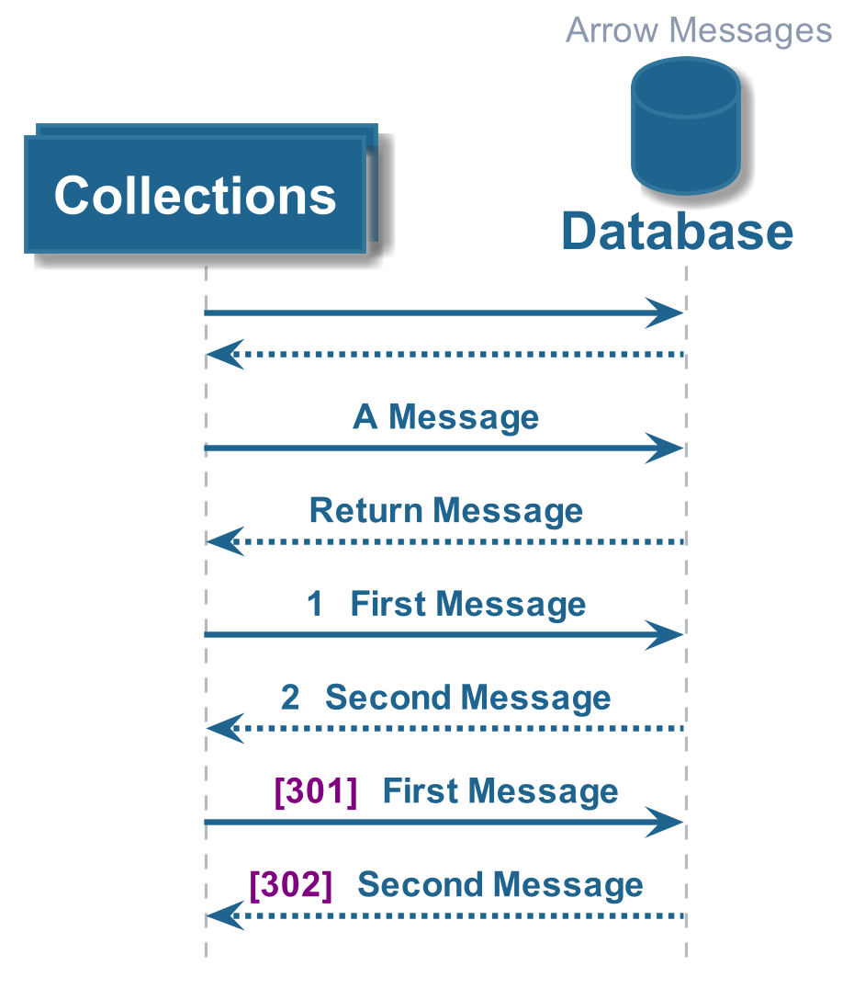

# Hello World

This provides people with an introduction to PlantUML and some tips to keep the
PlantUML script clean and readable.

## Defining Arrows

Arrows are the flow of logic in the diagrams, the different types that can be defined are
showin the diagram below. The [Code Example](./01_defining_arrows.plantuml) demonstrates how
each of these can be defined.

## Types of Arrows

The termination style of the arrows can be changed to represent different things (as shown below).
In the [Code Example](./02_arrow_types.plantuml) each type is demonstrated including some exceptions
to the rules.

## Arrow Line Types

The line style of the arrows can also be changed, from solid to dotted, from one colour to another (as shown below).
The [Code Examples](./03_arrow_line_types.plantuml) demonstrate how you can define each.

## Arrow Messages

Each of the arrows can include a message (as shown below). PlantUML also supports auto-numbering
of these messages, which is useful if you are required to explain the logic further. 

The [Code Example](./04_arrow_messages.plantuml) demonstrates how you can set these up and write messages
on the arrows.

________

| [BACK](../README.md) | [HOME](../../README.md) |
|:--------------------:|:-----------------------:|
