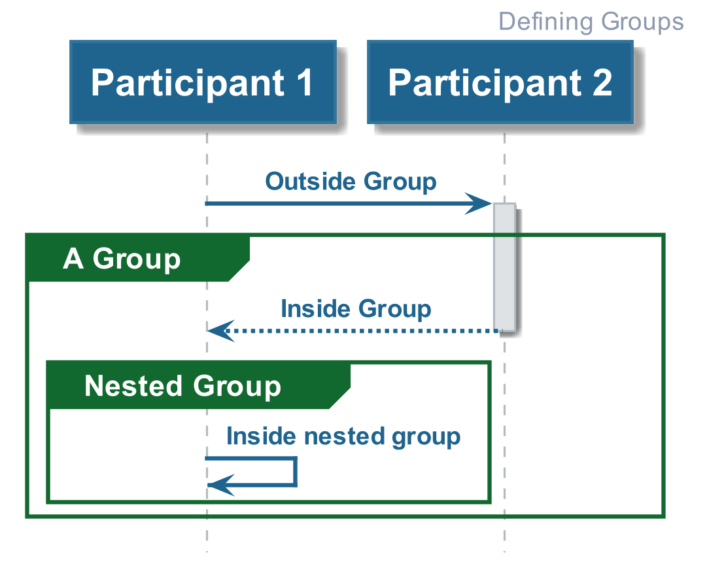
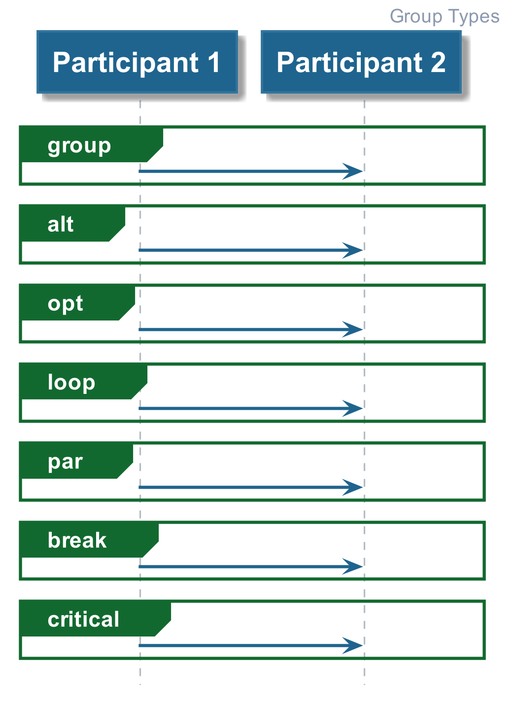
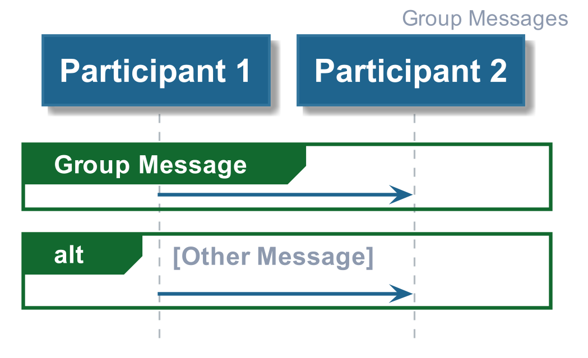
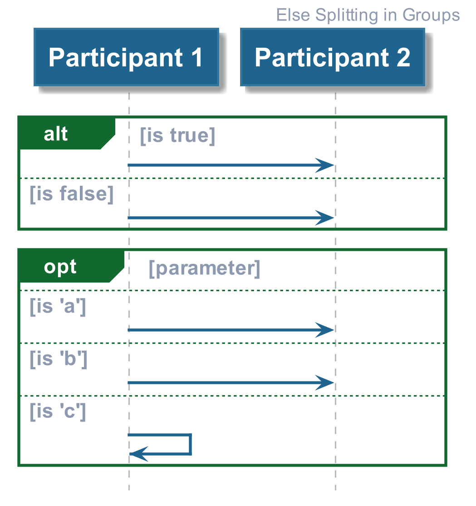

# Hello World

This provides people with an introduction to PlantUML and some tips to keep the
PlantUML script clean and readable.

## Defining Groups

A group shows up as a box surrounding 0 or more arrows on the diagram (see below).

The [Code Example](./01_defining_groups.plantuml) demonstrates how to define a group, 
including nesting of groups.

## Types of Groups

There are different types of group (as shown below), however all of these different
types function in identical ways (with the exception of 'group').

The [Code Example](./02_group_types.plantuml) demonstrates how to define each of these different types.

## Group Messages

For each type of group, you can define messages (as shown below), which we demonstrate how 
to do this in the [Code Example](./03_group_messages.plantuml).

## Else Splitting in Groups

Within a group, you may have conditions with different sequences. Else Splitting of the
groups can be used (see below). The [Code Example](./04_group_else_splitting.plantuml) demonstrates
how to do this.

________

| [BACK](../README.md) | [HOME](../../README.md) |
|:--------------------:|:-----------------------:|
