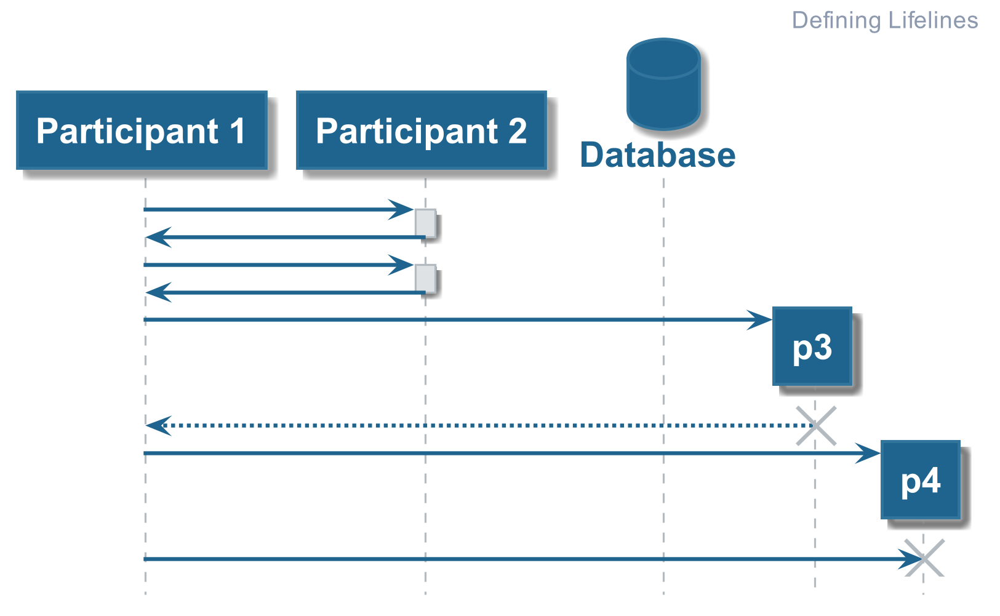
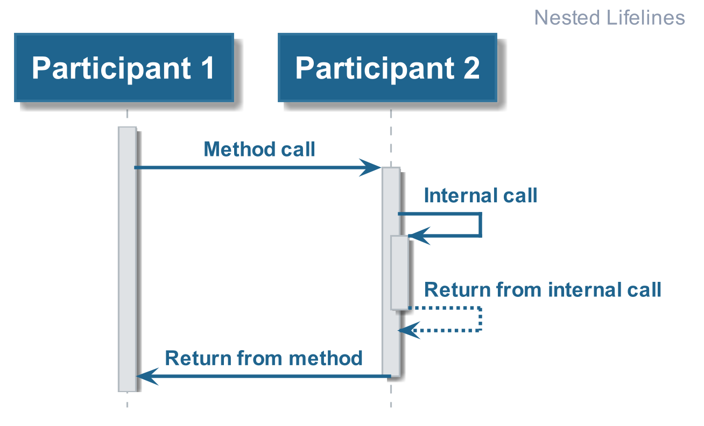

# Hello World

This provides people with an introduction to PlantUML and some tips to keep the
PlantUML script clean and readable.

## Defining Lifelines

Lifelines are used to visualise the life cycle of the participant (see below).

The [Code Example](./01_defining_lifelines.plantuml) demonstrates how we can define each
of the required parts to showing the life cycle of the participants.

## Nested Lifelines

When scenario's get more complicated, there may be a need to show nested lifelines (see below).

The [Code Example](./02_nested_process_lifelines.plantuml) demonstrates how you can script nested lifelines
using PlantUML.

________

| [BACK](../README.md) | [HOME](../../README.md) |
|:--------------------:|:-----------------------:|
