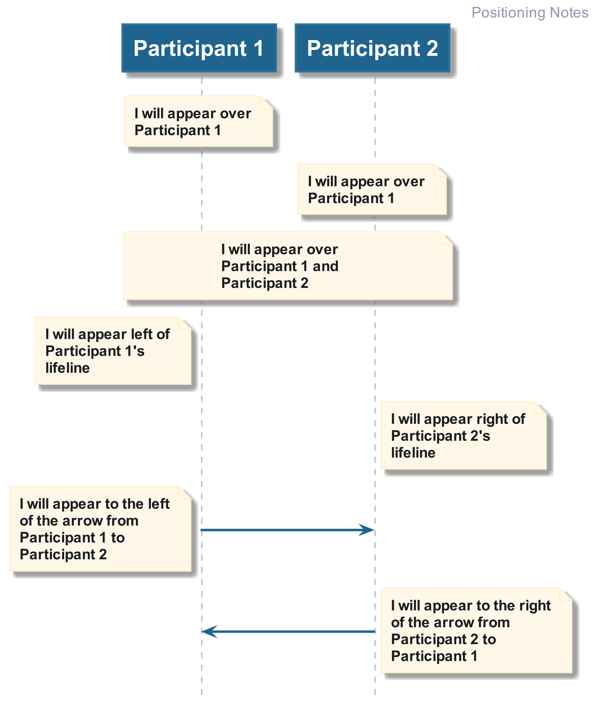

# Hello World

This provides people with an introduction to PlantUML and some tips to keep the
PlantUML script clean and readable.

## Defining Notes

To provide the user with additional information on the sequence diagram, notes can be used (see diagram).

The [Code Example](./01_defining_notes.plantuml) demonstrates how you can define a note on a participants lifeline.

## Block and Inline Notes

Notes can be defined in-line and as blocks, which both appear the same on the diagrams (see below).

The [Code Example](./02_block_notes.plantuml) demonstrates both methods and show why the block notes are preferred.

## Positioning Notes

Notes can be positioned in many different places (see below), however all of the positioning is in 
reference to something else, either a participants lifeline or a sequence arrow.

The [Code Example](./03_positioning_notes.plantuml) demonstrates each of the different relative
positioning that you can have.

## References vs. Notes

In addition to notes, you can define References (see below). These appear similarly to 
groups, but are treated as notes.

The [Code Example](./04_references_vs_notes.plantuml) demonstrates how to define a reference.

________

| [BACK](../README.md) | [HOME](../../README.md) |
|:--------------------:|:-----------------------:|
